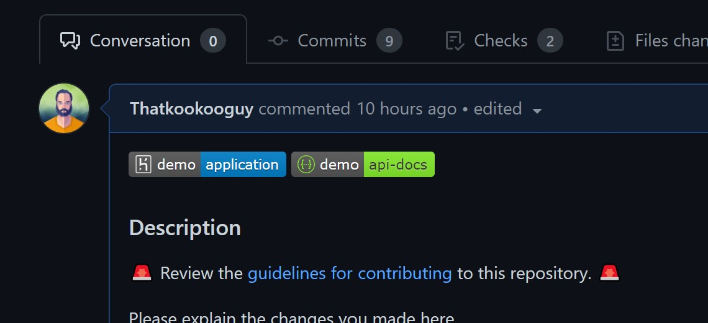

<p align="center">
  <a href="https://achievibit.kibibit.io/" target="blank">
  </a>
  <h2 align="center">
    @kibibit/kb-badger-action
  </h2>
</p>
<p align="center">
  <a href="#contributors-"></a>
</p>
<p align="center">
 <!-- ALL-CONTRIBUTORS-BADGE:START - Do not remove or modify this section -->
<a href="#contributors-"></a>
<!-- ALL-CONTRIBUTORS-BADGE:END -->
</p>
<p align="center">
  Add deployment baddges to Pull-Requests
</p>
<hr>

When an Environment is deployed successfully, add a badge to PR body with links to environment

## Inputs

| Input Name  | Description | Default | Required |
| :-------------: | :-------------: | :-------------: | :-------------: |
| github-token | The GitHub token used to create an authenticated client | `${{ github.token }}` | ✔️ |
| badge-left | Left-Hand side text of badge | `demo` | ❌ |
| badge-right | Right-Hand side text of badge | `application` | ❌ |
| badge-color | Right-Hand side shield color | `informational` | ❌ |
| badge-logo | Badge Logo | `undefined` | ❌ |
| badge-path | Path to navigate to in deployment | `undefined` | ❌ |

These inputs are repeated 3 tims to support 3 simultanous badges.

- badge - badge-left, badge-right...
- badge2 - badge2-left, badge2-right...
- badge3 - badge3-left, badge3-right...

## Outputs

After adding the PR badge, the action outputs the time it finished

## Example usage
```yaml
name: Add PR Deploy Badge
# https://docs.github.com/en/actions/reference/events-that-trigger-workflows
on: [deployment_status]

jobs:
  badge:
    runs-on: ubuntu-latest
    permissions:
      # needed to change body of PR
      pull-requests: write
    # only runs this job on successful deploy
    if: github.event.deployment_status.state == 'success'
    steps:
    - name: kb-badger
      uses: kibibit/kb-badger-action@v1.7
      with:
        github-token: ${{secrets.GITHUB_TOKEN}}
        badge-left: demo
        badge-right: application
        badge-logo: heroku
        badge2-left: demo
        badge2-right: api--docs
        badge2-color: 85EA2D
        badge2-logo: swagger
        badge2-path: /api/docs
```

## Screenshots


## Contributors ✨

Thanks goes to these wonderful people ([emoji key](https://allcontributors.org/docs/en/emoji-key)):
<!-- ALL-CONTRIBUTORS-LIST:START - Do not remove or modify this section -->
<!-- prettier-ignore-start -->
<!-- markdownlint-disable -->
<table>
  <tr>
    <td align="center"><a href="http://thatkookooguy.kibibit.io/"><br /><sub><b>Neil Kalman</b></sub></a><br /><a href="https://github.com/Kibibit/achievibit/commits?author=Thatkookooguy" title="Code">💻</a> <a href="https://github.com/Kibibit/achievibit/commits?author=Thatkookooguy" title="Documentation">📖</a> <a href="#design-Thatkookooguy" title="Design">🎨</a> <a href="#maintenance-Thatkookooguy" title="Maintenance">🚧</a> <a href="#infra-Thatkookooguy" title="Infrastructure (Hosting, Build-Tools, etc)">🚇</a> <a href="https://github.com/Kibibit/achievibit/commits?author=Thatkookooguy" title="Tests">⚠️</a></td>
  </tr>
</table>

<!-- markdownlint-restore -->
<!-- prettier-ignore-end -->

<!-- ALL-CONTRIBUTORS-LIST:END -->

This project follows the [all-contributors](https://github.com/all-contributors/all-contributors) specification. Contributions of any kind are welcome!

<div>Icons made by <a href="https://www.freepik.com" title="Freepik">Freepik</a> from <a href="https://www.flaticon.com/" title="Flaticon">www.flaticon.com</a></div>

## Stay in touch

- Author - [Neil Kalman](https://github.com/thatkookooguy)
- Website - [https://github.com/kibibit](https://github.com/kibibit)
- StackOverflow - [thatkookooguy](https://stackoverflow.com/users/1788884/thatkookooguy)
- Twitter - [@thatkookooguy](https://twitter.com/thatkookooguy)
- Twitter - [@kibibit_opensrc](https://twitter.com/kibibit_opensrc)
